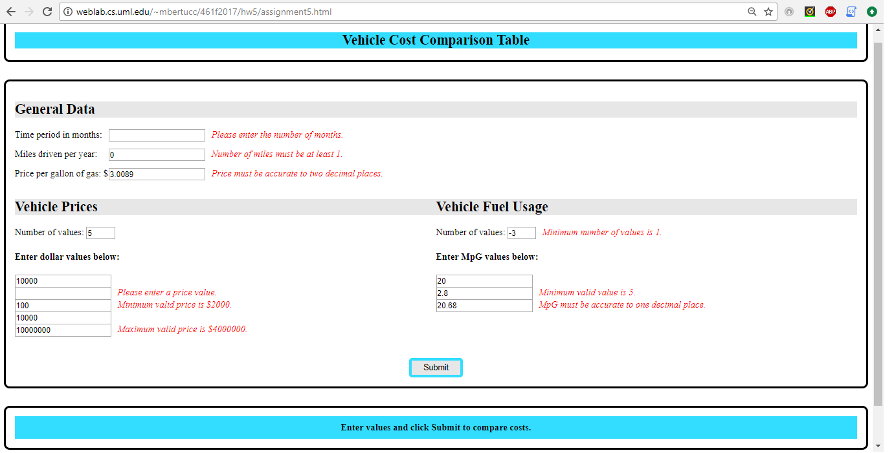

## GUI I Fall 2017 Homework #5

An enhancement of the web application built for HW4 (https://github.com/mbertucci1/GUI-HW4).

This time, form validation is implemented using the jQuery Validation Plugin (https://jqueryvalidation.org/) in order to provide the user with more specific and helpful feedback about input errors.

Also made some minor improvements to the page:
- Page now has a title box, formatted to match the style of the rest of the page
- The page now auto-scrolls to the generated table when the user clicks the submit button
- When changing the number of inputs for price or fuel consumption, the change now occurs via the "onchange" event instead of the "oninput" event. This means the dynamic inputs will be recreated when the user focuses out of the "number of values" field, rather than as the user is typing into it.

Example screenshot showing validation error messages: 

